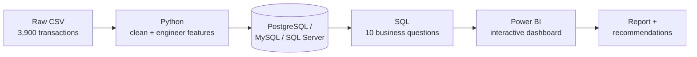
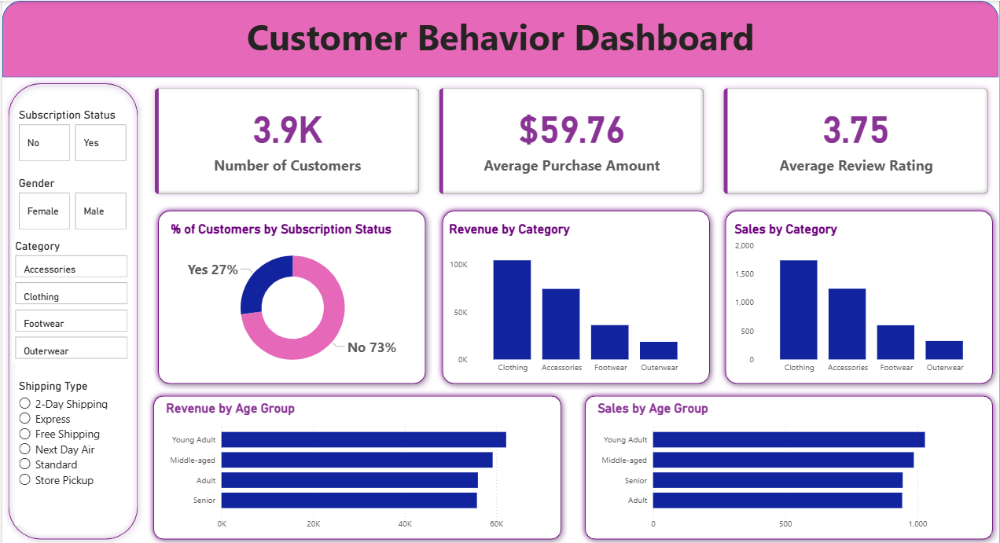
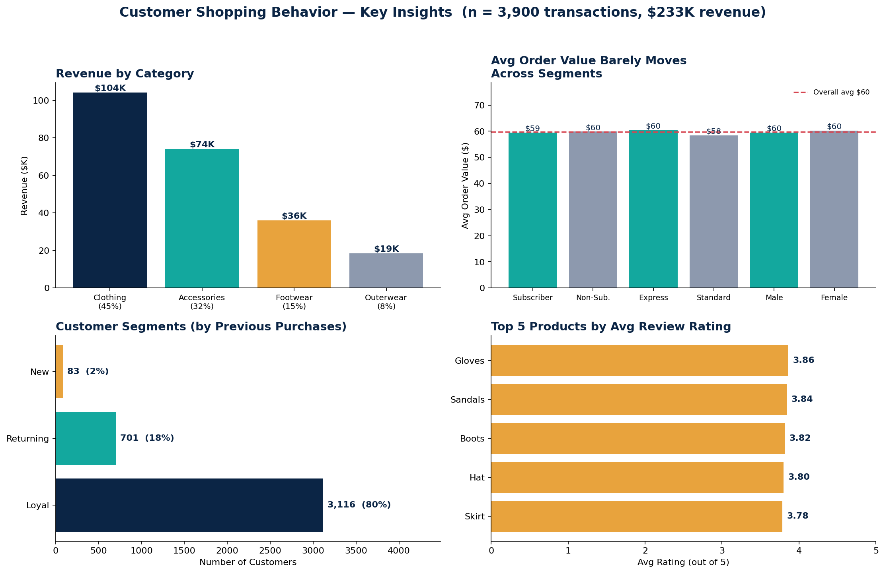

# Customer Shopping Behavior Analysis — End-to-End Data Analytics Project


An end-to-end data analytics pipeline — **Python → SQL → Power BI** — analyzing 3,900 retail transactions to answer one question: *how can a retail company use its own shopping data to grow revenue, improve retention, and spend its marketing budget where it actually moves the needle?*

### [**→ Open the Live Interactive Dashboard**](https://<your-username>.github.io/<your-repo>/)

A cross-filterable dashboard (Plotly.js) — filter by gender, subscription, category, season, or shipping type and every KPI and chart recalculates instantly. No install required. *(That link is a placeholder — update it with your GitHub Pages URL once you've done the one-time setup in "Phase 4" below.)*

---

## Business Problem

> A retail company wants to understand its customers' shopping behavior to improve sales, satisfaction, and long-term loyalty. Management has noticed shifts in purchasing patterns across demographics, product categories, and channels, and wants to know: **which factors — discounts, reviews, seasonality, payment method — actually drive purchase decisions and repeat business?**

**Deliverables:** cleaned dataset, SQL-driven business analysis, an interactive Power BI dashboard, and a report translating both into concrete recommendations.

---

## Tech Stack

| Layer | Tools |
|---|---|
| Data cleaning & feature engineering | Python, pandas |
| Database integration | SQLAlchemy (PostgreSQL / MySQL / SQL Server) |
| Business analysis | SQL — aggregations, CTEs, window functions |
| Visualization | Power BI |
| Version control & docs | Git, Markdown |

## Dataset

| | |
|---|---|
| **Rows** | 3,900 transactions |
| **Columns** | 18 (demographics, purchase details, shopping behavior) |
| **Missing data** | 37 nulls in `Review Rating` — imputed with each product category's median rating |
| **Source** | Public retail customer-behavior dataset (included as `data/customer_shopping_behavior.csv`) |

---

## Workflow



### Phase 1 — Python: Data Preparation (`Customer_Shopping_Behavior_Analysis.ipynb`)
- Loaded and profiled the dataset (`.info()`, `.describe()`)
- Imputed 37 missing `review_rating` values using the **median rating per category** (not a global median — avoids skew across very different product types)
- Standardized column names to snake_case
- Engineered `age_group` (quartile-based: Young Adult / Adult / Middle-aged / Senior) and `purchase_frequency_days` (mapped from categorical purchase frequency to a numeric day count)
- Verified `discount_applied` and `promo_code_used` were redundant (100% match) and dropped the duplicate column
- Loaded the cleaned table into a SQL database via SQLAlchemy (PostgreSQL, MySQL, and SQL Server connection code all included)

### Phase 2 — SQL: Business Questions (`customer_behavior_sql_queries.sql`)
Ten queries answering concrete business questions — revenue by gender, discount-using high spenders, top-rated products, shipping-type comparison, subscriber economics, discount-dependent products, customer segmentation, best sellers per category, repeat-buyer subscription rates, and revenue by age group. Uses `GROUP BY`, subqueries, `CASE` logic, and `ROW_NUMBER() OVER (PARTITION BY ...)` for top-N-per-group ranking.

### Phase 3 — Power BI: Interactive Dashboard (`Customer Behavior Dashboard.pbix`)



Filterable by subscription status, gender, category, and shipping type; surfaces revenue and order volume by category and age group, plus the subscriber/non-subscriber split.

### Phase 4 — Live Interactive Dashboard (`docs/index.html`)

A second, browser-based dashboard built with **Plotly.js** — no Power BI license needed to view it. Every KPI and chart (revenue by category, avg order value by segment, customer segments, top-rated products, seasonality, payment mix) recalculates live from five combinable filters. Runs entirely client-side; the full dataset is embedded in the page.

**To make it a live public link (2 minutes, one-time):**
1. Push this repo to GitHub.
2. Go to **Settings → Pages**.
3. Under "Build and deployment", set **Source: Deploy from a branch**, **Branch: main**, **Folder: /docs** → **Save**.
4. GitHub gives you a URL like `https://<your-username>.github.io/<repo-name>/` — put that in the link at the top of this README and in your LinkedIn post.

Until then, open `docs/index.html` directly in any browser to try it locally — double-click the file, no server needed.

---

## Key Insights — What Actually Moves Revenue

All numbers below are computed directly from `data/customer_shopping_behavior.csv` using the same logic as the SQL file — fully reproducible from this repo.



**1. Category mix, not customer segment, is the biggest lever.**
Clothing (45% · $104K) and Accessories (32% · $74K) alone generate **77% of total revenue** ($233K across 3,900 orders). Footwear and Outerwear combined are the remaining 23%.

**2. The subscription program isn't buying bigger baskets.**
Subscribers spend **$59.49/order** on average; non-subscribers spend **$59.87** — statistically flat, and directionally the *opposite* of what a "subscriber premium" story would predict. Subscribers also generate only 27% of total revenue despite being the "loyalty" tier. Repeat buyers (>5 previous purchases) subscribe at 27.6% — essentially the same as the 27.0% baseline rate. **The subscription perk isn't correlated with higher spend or higher loyalty engagement.** (Data quirk worth flagging: 100% of subscribers in this dataset are male — 0 of 1,248 female customers are subscribers — so this comparison is effectively subscriber vs. non-subscriber *men*; there's no female-subscriber data to compare against.)

**3. The gender revenue gap is a mix effect, not a behavior effect.**
Male customers generate 68% of revenue ($157,890) vs. 32% for female customers ($75,191) — but that's because 68% of the customer base is male. Average order value is nearly identical: **$59.54 (male) vs. $60.25 (female)**. Reading the top-line revenue split as a spending-behavior difference would be a mistake.

**4. Discount usage is broad — but one segment stands out.**
43% of all purchases use a discount, and the top 5 discount-reliant products (Hat, Sneakers, Coat, Sweater, Pants) sit at 47–50%. But 839 customers (22% of the base) used a discount and *still* spent **$79.79/order — 34% above the $59.76 overall average**. That's a distinct high-value segment hiding inside the "discount shopper" label.

**5. Shipping speed, age, and season are weak differentiators.**
Express-shipping orders average only 3.5% more than Standard ($60.48 vs. $58.46). Revenue is nearly flat across age quartiles (range: $55.8K–$62.1K, an 11% spread) and across seasons (range: $55.8K–$60.0K, a 7.6% spread). None of these three are strong targeting variables on their own.

**6. The current Loyal/Returning/New split is too generous to be actionable.**
Using this project's segmentation rule (New = 1 prior purchase, Returning = 2–10, Loyal = everything else), **80% of customers already qualify as "Loyal."** That's a sign the thresholds need re-cutting — e.g., quantile-based or RFM-style segmentation — before this segment can drive targeted retention campaigns.

---

## Business Recommendations

1. **Concentrate merchandising and ad spend on Clothing + Accessories** — these two categories already drive 77% of revenue; treat Footwear/Outerwear as secondary.
2. **Redesign the subscription offer, don't just promote it harder** — current subscribers show no lift in order value and repeat buyers are no more likely to subscribe than average. The perk itself (not the marketing of it) needs to change — e.g., tiered free shipping, early access to Clothing/Accessories drops, birthday offers.
3. **Build a targeted offer for the "high-value discount" segment** — the 839 customers who redeem discounts yet still spend 34% above average are a distinct, high-LTV group; give them a dedicated tier instead of running the same blanket discount as everyone else.
4. **Re-cut customer segmentation before using it for targeting** — an 80/18/2 Loyal/Returning/New split isn't actionable; rebuild it with quantile or RFM-based thresholds to isolate a real top tier.
5. **Deprioritize age, season, and shipping-speed as targeting variables** — none moves average order value by more than ~11%; reallocate that campaign budget toward the category and discount-segment levers above.

---

## Repository Structure

```
customer-trends-data-analysis-SQL-Python-PowerBI/
├── data/
│   └── customer_shopping_behavior.csv          # Raw dataset (3,900 rows x 18 columns)
├── Customer_Shopping_Behavior_Analysis.ipynb   # Python: cleaning, feature engineering, DB load
├── customer_behavior_sql_queries.sql           # 10 business-question SQL queries
├── Customer Behavior Dashboard.pbix            # Power BI interactive dashboard
├── Business Problem  Document.pdf              # Business case brief
├── Customer Shopping Behavior Analysis.pdf     # Written project report
├── requirements.txt                            # Python dependencies
├── .env.example                                # Database credential template (no real secrets)
├── docs/
│   └── index.html                              # Live interactive dashboard (Plotly.js, GitHub Pages-ready)
├── assets/
│   ├── power_bi_dashboard.png                  # Dashboard screenshot
│   └── key_insights_dashboard.png              # Key-metrics summary chart
└── README.md
```

---

## How to Reproduce

```bash
# 1. Clone
git clone https://github.com/<your-username>/customer-trends-data-analysis-SQL-Python-PowerBI.git
cd customer-trends-data-analysis-SQL-Python-PowerBI

# 2. Install dependencies
python -m venv venv && source venv/bin/activate   # Windows: venv\Scripts\activate
pip install -r requirements.txt

# 3. Configure database credentials (never hardcode these)
cp .env.example .env
# edit .env with your local PostgreSQL / MySQL / SQL Server credentials, then:
export $(cat .env | xargs)                        # macOS/Linux
# or set them as System Environment Variables on Windows
```

1. Open `Customer_Shopping_Behavior_Analysis.ipynb` and run all cells (choose the PostgreSQL, MySQL, or SQL Server section that matches your database).
2. Run `customer_behavior_sql_queries.sql` against the resulting `customer` table.
3. Open `Customer Behavior Dashboard.pbix` in Power BI Desktop and point it at your database to refresh.

---

## Skills Demonstrated

Data cleaning & missing-value imputation strategy · feature engineering (binning, categorical-to-numeric mapping) · relational database integration across 3 engines via SQLAlchemy · SQL (CTEs, window functions, subqueries, conditional aggregation) · Power BI dashboard design · credential hygiene (env-based config) · data storytelling · translating query output into business recommendations.

---

## License

This project is licensed under the MIT License — see [`LICENSE`](LICENSE) for details.

## Connect

**ٍSaleh Mahbub**
LinkedIn: `linkedin.com/in/saleh-mahbub-aa717b159`
`salehmahbub8@gmail.com`

*If you spot something in the analysis worth pushing back on, open an issue — that's the kind of feedback that makes a portfolio project actually useful.*
