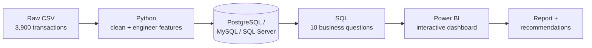

# Customer Shopping Behavior Analysis — End-to-End Data Analytics Project


An end-to-end data analytics pipeline — **Python → SQL → Power BI** — on 3,900 retail transactions, answering one question: *how can a retailer use its own shopping data to grow revenue, improve retention, and target its marketing budget correctly?*

### [**→ Open the Live Interactive Dashboard**](https://<your-username>.github.io/<your-repo>/)

Cross-filter by gender, subscription, category, season, or shipping type — every KPI and chart updates instantly, no install required. *(Placeholder link — update it with your GitHub Pages URL once "Phase 4" below is set up.)*

---

## Business Problem

> A retail company wants to understand its customers' shopping behavior to improve sales, satisfaction, and long-term loyalty, and needs to know: **which factors — discounts, reviews, seasonality, payment method — actually drive purchase decisions and repeat business?**

## Tech Stack

| Layer | Tools |
|---|---|
| Data cleaning & feature engineering | Python, pandas |
| Database integration | SQLAlchemy (PostgreSQL / MySQL / SQL Server) |
| Business analysis | SQL — aggregations, CTEs, window functions |
| Visualization | Power BI, Plotly.js |

## Dataset

| | |
|---|---|
| **Rows** | 3,900 transactions |
| **Columns** | 18 (demographics, purchase details, shopping behavior) |
| **Missing data** | 37 nulls in `Review Rating` — imputed with each category's median |
| **Source** | `data/customer_shopping_behavior.csv` |

---

## Workflow



**Phase 1 — Python** (`Customer_Shopping_Behavior_Analysis.ipynb`): profiled the data, imputed 37 missing `review_rating` values with each category's median, standardized columns to snake_case, engineered `age_group` (quartile bins) and `purchase_frequency_days`, dropped `promo_code_used` (100% redundant with `discount_applied`), and loaded the clean table into SQL via SQLAlchemy.

**Phase 2 — SQL** (`customer_behavior_sql_queries.sql`): 10 business questions using `GROUP BY`, subqueries, `CASE` logic, and `ROW_NUMBER() OVER (PARTITION BY ...)` — revenue by gender, discount-driven high spenders, top-rated products, shipping comparison, subscriber economics, segmentation, and more.

**Phase 3 — Power BI** (`Customer Behavior Dashboard.pbix`): filterable by subscription, gender, category, and shipping type.


**Phase 4 — Live Dashboard** (`docs/index.html`): browser-based version built with Plotly.js — same KPIs, fully interactive, no Power BI license needed, dataset embedded client-side. **To go live:** push to GitHub → Settings → Pages → Deploy from branch `main`, folder `/docs` → you get a `github.io` URL. Until then, just open `docs/index.html` directly — no server needed.

---

## Key Insights — What Actually Moves Revenue

Computed directly from the raw dataset using the same logic as the SQL file — fully reproducible from this repo.


1. **Category mix is the real lever.** Clothing (45% · $104K) + Accessories (32% · $74K) = **77% of revenue**; Footwear and Outerwear split the remaining 23%.

2. **Subscription doesn't buy bigger baskets.** $59.49/order for subscribers vs. **$59.87** for non-subscribers — flat, if not slightly negative. Subscribers generate only 27% of revenue, and repeat buyers (>5 purchases) subscribe at 27.6% — barely above the 27.0% base rate. *(100% of subscribers in this dataset are male, so this is really a men-vs-men comparison.)*

3. **The gender revenue gap is a mix effect, not a behavior effect.** Men generate 68% of revenue simply because 68% of customers are men — average order value is nearly identical ($59.54 vs. $60.25).

4. **Discounting is broad, but one segment stands out.** 43% of orders use a discount; the top 5 discount-reliant products sit at 47–50%. But 839 customers (22%) discount *and* still spend **$79.79/order — 34% above average**.

5. **Shipping speed, age, and season barely move order value.** Express is only 3.5% above Standard; age-group revenue spans just 11%; season spans 7.6%.

6. **The Loyal/Returning/New split is too generous to be useful.** 80% of customers already count as "Loyal" under the current rule (>10 previous purchases) — needs re-cutting (RFM or quantile-based) before it can drive targeting.

## Business Recommendations

1. **Concentrate spend on Clothing + Accessories** — 77% of revenue lives there.
2. **Redesign the subscription perk, don't just promote it** — no measurable lift in order value or loyalty today.
3. **Build a tier for high-value discount users** — the 839 customers spending 34% above average despite discounting.
4. **Re-cut segmentation with RFM or quantiles** — the current 80/18/2 split isn't actionable.
5. **Deprioritize age/season/shipping-speed targeting** — none moves order value by more than ~11%.

---

## Repository Structure

```
customer-trends-data-analysis-SQL-Python-PowerBI/
├── data/
│   └── customer_shopping_behavior.csv          # Raw dataset (3,900 rows x 18 columns)
├── Customer_Shopping_Behavior_Analysis.ipynb   # Python: cleaning, feature engineering, DB load
├── customer_behavior_sql_queries.sql           # 10 business-question SQL queries
├── Customer Behavior Dashboard.pbix            # Power BI interactive dashboard
├── Business Problem  Document.pdf              # Business case brief
├── Customer Shopping Behavior Analysis.pdf     # Written project report
├── requirements.txt                            # Python dependencies
├── .env.example                                # Database credential template (no real secrets)
├── docs/index.html                             # Live interactive dashboard (Plotly.js, GitHub Pages-ready)
├── assets/                                     # Dashboard screenshot + key-insights chart
├── LICENSE                                     # MIT License
└── README.md
```

## How to Reproduce

```bash
git clone https://github.com/<your-username>/customer-trends-data-analysis-SQL-Python-PowerBI.git
cd customer-trends-data-analysis-SQL-Python-PowerBI
python -m venv venv && source venv/bin/activate   # Windows: venv\Scripts\activate
pip install -r requirements.txt
cp .env.example .env   # fill in your DB credentials, then export them (never hardcode)
```

1. Run `Customer_Shopping_Behavior_Analysis.ipynb` top to bottom (pick the PostgreSQL/MySQL/SQL Server section that matches your database).
2. Run `customer_behavior_sql_queries.sql` against the resulting `customer` table.
3. Open `Customer Behavior Dashboard.pbix` in Power BI Desktop and refresh against your database.

---

## Skills Demonstrated

Data cleaning & missing-value imputation · feature engineering · relational DB integration across 3 engines via SQLAlchemy · SQL (CTEs, window functions, conditional aggregation) · Power BI & Plotly.js dashboarding · credential hygiene (env-based config) · data storytelling · business recommendation writing.

## License

This project is licensed under the MIT License — see [`LICENSE`](LICENSE) for details.

## Connect

**ٍSaleh Mahbub**
LinkedIn: `linkedin.com/in/saleh-mahbub-aa717b159`
`salehmahbub8@gmail.com`

*If you spot something in the analysis worth pushing back on, open an issue.*
